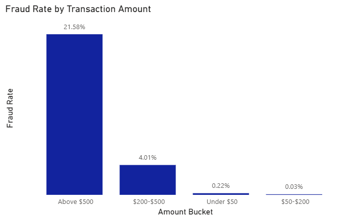
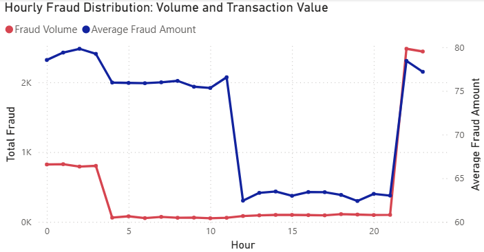
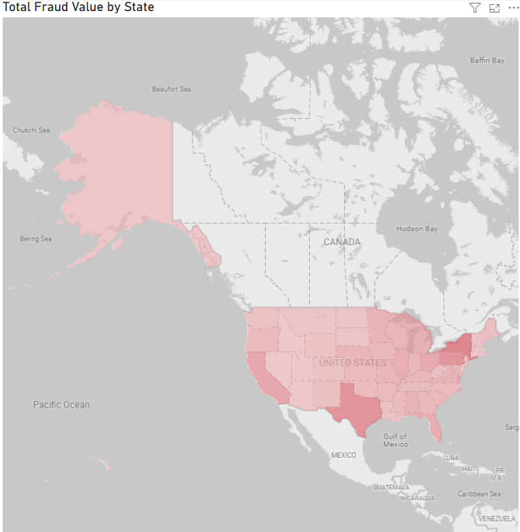
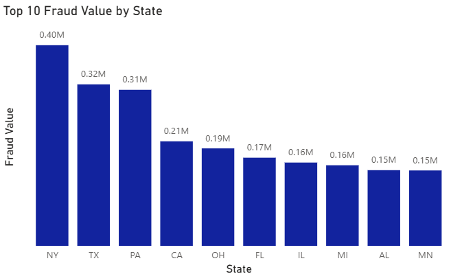

# Payment Fraud Risk & Anomaly Detection

## I. Project Overview

This project identifies high-risk fraudulent patterns within credit card transactions to mitigate financial loss. Using **SQL** for data engineering and **Power BI** for risk modeling, I built a pipeline that processes 1.85M transactions to flag "High Risk" anomalies—specifically targeting high-value transactions and late-night activity peaks.

## II. Data Source

The dataset used for this project contains:

* **Financials:** Transaction Amount ($), Merchant Category, and Is_Fraud flag.
* **Temporal:** Transaction Date and Time (24-hour cycle).
* **Geography:** State, City, and Latitude/Longitude coordinates.
* **Demographics:** Spending categories (e.g., `shopping_net`, `grocery_pos`, `entertainment`).

## III. Key Features

* **Data Engineering (SQL):** Performed complex aggregations and feature engineering to create **Amount Buckets** (Under $50 to Above $500) and **Hour of Day** extractions.
* **Risk Modeling:** Calculated a dynamic **Fraud Rate** metric to normalize risk across different transaction volumes.
* **Geospatial Analysis:** Mapped fraud density to identify commercial hubs with "localized" risk rather than nationwide distribution.
* **Interactive Visualization:** Developed a Power BI dashboard featuring dual-axis trend lines and tree-map category breakdowns.

## IV. Business Insights & Analysis

### 1. Temporal & Category Risk Spread

The **Tree Map** and **Trend Line** visualize where the highest value of fraud is concentrated.

* **Sector Vulnerability:** `shopping_net` accounts for **44.93%** of fraud value, suggesting that digital transformation in retail has outpaced applied security protocols.
* **The "Night Owl" Peak:** Fraud volume and average transaction value spike between **22:00 and 02:00**, indicating a prime window for automated "Step-up Authentication" (MFA).

### 2. Transaction Magnitude Analysis

The **Bar Chart** segments risk by bucket amount, revealing a massive disparity in fraud probability.

* **High-Value Anomaly:** Transactions **Above $500** have a staggering **21.58% fraud rate**, whereas transactions under $200 maintain a negligible risk (below 0.22%).

### 3. Geospatial Risk Concentration (Map Analysis)

The **Geographic Heat Map** and **Top 10 State Bar Chart** illustrate how fraud risk is physically distributed across the network.

* **Localized Commercial Hubs:** Fraud is not evenly distributed; it is highly concentrated in high-density commercial states. **New York (NY)**, **Texas (TX)**, and **Pennsylvania (PA)** account for the highest total fraud value, with NY alone reaching **$0.40M**.
* **Southern Exposure:** Texas (TX) and Florida (FL) show significant "Risk Heat," likely due to the high volume of tourism and cross-border commerce which often mask fraudulent patterns.

## V. Conclusions and Recommendations

### 1. Targeted Risk-Based Authentication

* **Implement Transaction Thresholds:** Introduce mandatory secondary verification (biometrics or SMS OTP) for any transaction exceeding $500, targeting the segment with 21.58% risk.
* **Temporal Velocity Rules:** Flag accounts for immediate review if multiple high-value "shopping_net" transactions occur during the 22:00–02:00 window.

### 2. Geographic Resource Allocation

* **Localized Fraud Prevention:** Since fraud is concentrated in states like **NY, TX, and PA**, regional branches in these hubs should receive specialized training in recognizing local merchant fraud patterns.

## VI. Limitations & Future Improvements

* **Static Snapshot:** The current model uses historical data. Future versions will integrate with a **Python/Spark** environment for real-time stream processing.
* **Predictive Modeling:** While the current SQL logic flags anomalies based on historical rates, the next phase involves a **Random Forest** classifier to predict fraud probability before the transaction is cleared.

## VII. Tools Used

* **Data Engineering:** SQL (Aggregations, CASE statements, Temporal extraction)
* **Data Visualization:** Power BI (Tree Maps, Geospatial Maps, Dual-axis charts)
* **Documentation:** Markdown

## VIII. How to View

1. **Dataset:** Check the `/Data` folder for the and extract the dataset.
2. **SQL Queries:** Check the `/Scripts` folder for the engineering scripts used to process the 1.85M records.
3. **Dashboard:** Open the `Fraud_Risk_Dashboard.pbix` file or view the `.png` exports in the `/Image` folder.

